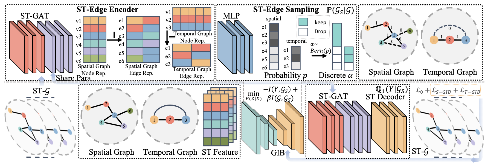

# Explainable Spatio-Temporal Graph Neural Networks

This is the PyTorch implementation by <a href='https://github.com/tjb-tech'>@Jiabin Tang</a> for STExplainer model proposed in this paper:

 >**Explainable Spatio-Temporal Graph Neural Networks**  
 > Jiabin Tang, Lianghao Xia, Chao Huang*\
 >*CIKM 2023*

\* denotes corresponding author
<p align="center">

</p>

In this paper, we propose an Explainable Spatio-Temporal Graph Neural Networks (STExplainer) framework that enhances STGNNs with inherent explainability, enabling them to provide accurate predictions and faithful explanations simultaneously. Our framework integrates a unified spatio-temporal graph attention network with a positional information fusion layer as the STG encoder and decoder, respectively. Furthermore, we propose a structure distillation approach based on the Graph Information Bottleneck (GIB) principle with an explainable objective, which is instantiated by the STG encoder and decoder. 

## Environment

Please first clone the repo and install the required environment, which can be done by running the following commands:

```shell
conda env create -n stexplainer python=3.8

conda activate stexplainer

# Torch with CUDA 11.6
pip install torch==1.12.0+cu116 torchvision==0.13.0+cu116 torchaudio==0.12.0 --extra-index-url https://download.pytorch.org/whl/cu116
# Clone our STExplainer
git clone https://github.com/HKUDS/STExplainer.git
cd STExplainer
# Install required libraries
pip install -r requirements.txt
```


##  Dataset

We utilized three traffic datasets and two crime datasets to evaluate STExplainer: *PEMS4, 7, 8* (Traffic), *NYC, CHI crime* (Crime).

## Examples to run the codes

We could modify configuration at [./config](https://github.com/HKUDS/STExplainer/config) to train or test our model on different datasets. There is an example on PEMS04: 

  - train PEMS4 (note that the "testonly" in configuration file should be 0)

```shell
python train.py --config ./config/STExplainer_pems4.yaml
```

  - test PEMS4 (note that the "testonly" in configuration file should be 1, and there is a corresponding checkpoints at [./results/model](https://github.com/HKUDS/STExplainer/results/model))

```shell
python train.py --config ./config/STExplainer_pems4.yaml
```


## Reference
If you find this work is helpful to your research, please consider citing our paper:
```
@inproceedings{10.1145/3583780.3614871,
author = {Tang, Jiabin and Xia, Lianghao and Huang, Chao},
title = {Explainable Spatio-Temporal Graph Neural Networks},
year = {2023},
isbn = {9798400701245},
publisher = {Association for Computing Machinery},
address = {New York, NY, USA},
url = {https://doi.org/10.1145/3583780.3614871},
doi = {10.1145/3583780.3614871},
booktitle = {Proceedings of the 32nd ACM International Conference on Information and Knowledge Management},
pages = {2432–2441},
numpages = {10},
location = {Birmingham, United Kingdom},
series = {CIKM '23}
}
```


## Acknowledgements
The structure of our code is based on [GSAT](https://github.com/Graph-COM/GSAT), [BasicTS](https://github.com/zezhishao/BasicTS) and [GIB](https://github.com/snap-stanford/GIB). Thank for their work.
